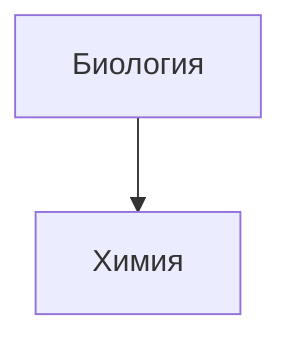

https://publish.obsidian.md/help-ru/Руководства/Форматирование+заметок

Пример простой сноски[^1] и пример сноски подлиннее
decwcwcwcwc
wcwcwwcwcw

сноски подлиннее^[большая_сноскwqdqwdqwа, 2f2f2f2]

Комментарий внутри текста: %%скрытый комментарий%% (который, не виден в режиме предварительного просмотра) Скрытый блок с комментариями: (который, так же не виден в режиме предварительного просмотра) %% Он может содержать множество строк %%

$$\begin{vmatrix}a & b\\ c & d \end{vmatrix}=ad-bc+dc$$

11111111111111111111111111111111

[^1]: ![[Снимок экрана 2024-11-11 в 00.46.31.png]]
	qdeqldnqkdqnqdqld
	dedededede
	ededwedew
	
	- d3d2233e3
	- 3e3e3e3
	- 3e3
	
	
